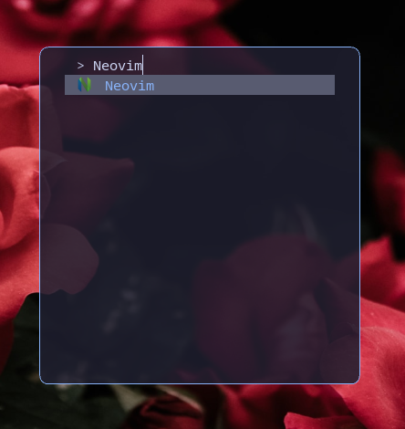
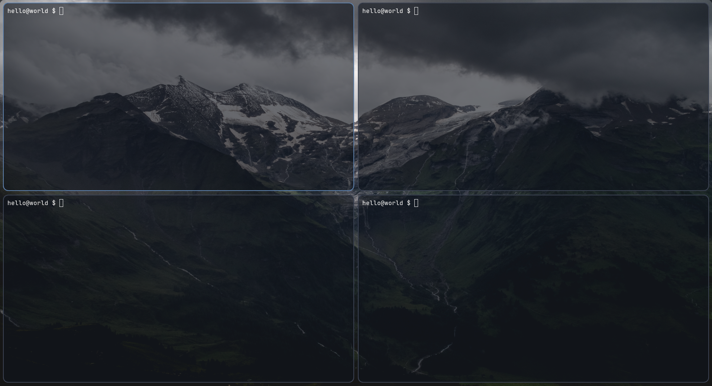
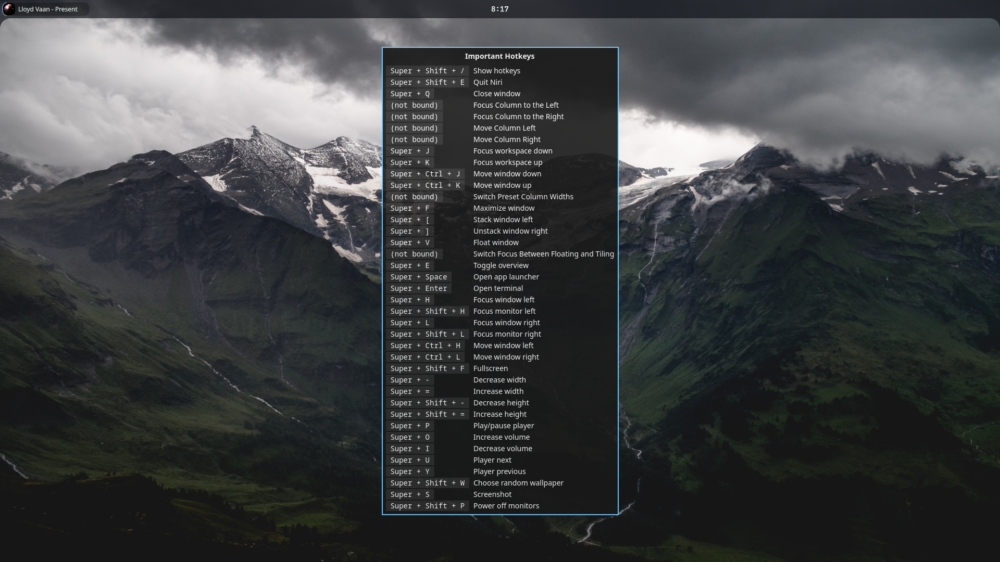
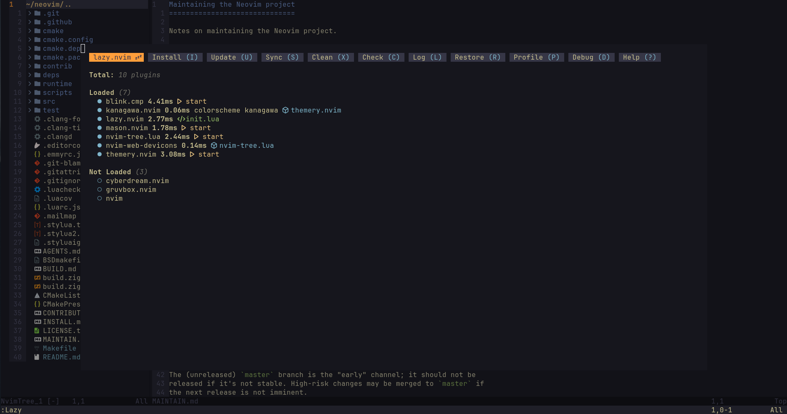
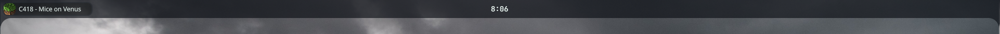

# Personal Arch Linux Configuration

## Included Configurations
- Fuzzel
- Ghostty
- Niri
- Neovim
- Quickshell

## [Fuzzel](https://codeberg.org/dnkl/fuzzel)

## [Ghostty](https://github.com/ghostty-org/ghostty)

## [Niri](https://github.com/niri-wm/niri)
Machine specific monitor configurations live in [niri/local](./config/niri/local).
A prompt during installation determines the configuration used.

## [Neovim](https://github.com/neovim/neovim)
Uses [Lazy.nvim](https://github.com/folke/lazy.nvim) as the package manager
Tree-sitter parsers are managed manually and installed via a script rather than through [nvim-treesitter](https://github.com/nvim-treesitter/nvim-treesitter) for example, however most query files were sourced from [nvim-treesitter](https://github.com/nvim-treesitter/nvim-treesitter)
More parsers can be installed by adding to [install-nvim-parsers.sh](./install-scripts/install-nvim-parsers.sh)
No LSPs, DAPs, etc are installed automatically and must be installed via Mason

### Plugins
- [Blink](https://github.com/saghen/blink.cmp) (auto-complete)
- [Nvim-tree](https://github.com/nvim-tree/nvim-tree.lua) (file manager)
- [Themery](https://github.com/zaldih/themery.nvim) (theme picker)
- [Mason](https://github.com/mason-org/mason.nvim) (Language support)

### Colorschemes
- [Kanagawa](https://github.com/rebelot/kanagawa.nvim) (favorite)
- [Catppuccin](https://github.com/catppuccin/nvim)
- [Cyberdream](https://github.com/catppuccin/nvim)
- [Gruvbox](https://github.com/ellisonleao/gruvbox.nvim)

### Tree-sitter info
| Name | Parser | Folds | Highlights | Indents | Injections | Locals |
| :--- | :----: | :---: | :--------: | :-----: | :--------: | :----: |
| C | [X] | [X] | [X] | [] | [X] | [] | 
| C# | [X] | [X] | [X] | [] | [X] | [X] | 
| C++ | [X] | [X] | [X] | [X] | [X] | [X] | 
| CSS | [X] | [X] | [X] | [X] | [X] | [] | 
| Go | [X] | [X] | [X] | [X] | [X] | [X] | 
| HTML | [X] | [] | [] | [] | [] | [] | 
| Java | [X] | [X] | [X] | [X] | [X] | [X] | 
| Json | [X] | [X] | [X] | [X] | [X] | [X] | 
| Jsx | [X] | [X] | [X] | [X] | [X] | [] | 
| Lua | [X] | [X] | [X] | [] | [X] | [] | 
| Markdown | [X] | [X] | [X] | [] | [X] | [] | 
| Markdown Inline | [X] | [] | [X] | [] | [X] | [] | 
| Python | [X] | [X] | [X] | [X] | [X] | [X] | 
| Query | [X] | [X] | [X] | [] | [] | [] | 
| Tsx | [X] | [X] | [X] | [X] | [X] | [X] | 
| Typescript | [X] | [] | [X] | [] | [] | [] | 
| Vim | [X] | [X] | [X] | [] | [X] | [] | 
| Vimdoc | [X] | [] | [X] | [] | [X] | [] | 

## [Quickshell](https://git.outfoxxed.me/quickshell/quickshell)

### [Wallpapers](./wallpapers)
This is subset of the wallpapers I found in [this](https://github.com/dharmx/walls/tree/main) repository.
Original authorship and licensing status is largely unknown, therefore all images are assumed to be copyrighted by their respective owners.

### Helpful links
- [Neovim LSP docs](https://neovim.io/doc/user/lsp)
- [Arch linux LSP references](https://neovim.io/doc/user/lsp)
- [Microsoft LSP references](https://microsoft.github.io/language-server-protocol/implementors/servers)
- [Tree-sitter docs](https://tree-sitter.github.io/tree-sitter)
- [Good query files](https://github.com/nvim-treesitter/nvim-treesitter)

## Local Data
| Path | Description |
| ---- | ----------- |
| `~/.local/share/dotfiles/wallpapers` | Wallpaper source directory |
| `~/.local/share/dotfiles/scripts` | Helper scripts (wallpaper randomizer, screenshot, etc) |
| `~/.local/share/nvim/site/parser` | Installed Tree-sitter parsers | 

